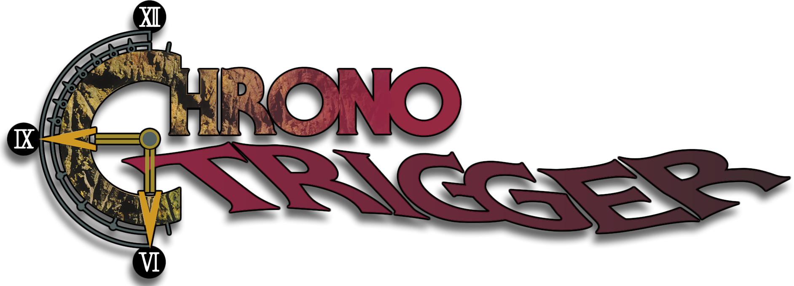

<div align=center>

[](https://gbatemp.net/threads/chrono-trigger-switch-port.682630/)

</div>
<h1 align=center>Chrono Trigger — Nintendo Switch port</h1>

</div>

This is a wrapper/port of the Android version of *[Chrono Trigger](https://play.google.com/store/apps/details?id=com.square_enix.android_googleplay.chrono)*
(`com.square_enix.android_googleplay.chrono`, v2.1.5). It loads the original game
binaries, patches them and runs them: we natively run the original Android `.so`
files inside a minimal emulated Android environment.

---

### Features

* **Extensive `config.ini`** — screen resolution (independent per handheld/docked,
  up to 4K supersampling), language, custom font loading, text shadows,
  performance tuning, and controller remapping, all editable without rebuilding.
* **Mod support** — drop `.ctp` patch files or loose-file "folder mods" into a
  `mods/` folder and they're applied automatically at startup, without ever
  touching your original game files.
* **Custom font loading** — swap the system-font text for a TTF of your
  choice (a matching pixel font, ChronoType, ships with the project), with
  auto-fit sizing and an optional SNES-style drop shadow.
* **Smoother, sharper visuals** — fixes for the shimmering/stuttering look
  the game has while scrolling or moving, crisp pixel-accurate rendering,
  straightened Equipment menu text, a clearer cursor highlight, and smoother
  diagonal movement.
* **Switch-native controller support** — real button prompts instead of
  touch/keyboard icons, optional right-stick movement, and remapping for the
  otherwise-unused (ZL | ZR | + | −) buttons.
* **Touch UI removed** — the mobile-only on-screen button overlays are
  hidden automatically.
* **Tidier install layout** — saves, mods, and settings each live in their own
  subfolder; upgrading from an older install migrates everything automatically.

---

### How to install

You're going to need the **`.apk`** for version 2.1.5. From it you need:
* `lib/arm64-v8a/libchrono.so` — the engine
* `lib/arm64-v8a/libc++_shared.so` — the C++ runtime it depends on
* the **entire `assets/` folder** — the game data (`resources.bin`, `001.dat`…
  `008.dat`, `007-en.dat`, `Shaders/`, `build_date.txt`)

To install:
1. Download `ct_nx.zip` and extract it to the root of your Switch SD card.
2. From your `.apk`, extract **`lib/arm64-v8a/libchrono.so`** to `/switch/ct/`.
3. From your `.apk`, extract **`lib/arm64-v8a/libc++_shared.so`** to `/switch/ct/`.
4. From your `.apk`, copy the **whole `assets/` directory** to `/switch/ct/assets/`.
5. *(Optional)* Create `/switch/ct/mods/` and drop in any `.ctp` mods or folder
   mods you want loaded — see [Mods](#mods) below.

If you're upgrading an existing install, just overwrite `ct_nx.nro` (and
`libchrono.so`/`libc++_shared.so`/`assets/` if they changed) — your settings and
save data are migrated automatically on first launch, see **Notes** below.

---

### Notes

This will not work in applet/album mode. Use a game override (hold R on a title)
or a forwarder, so the homebrew gets the full memory and required syscalls.

Everything the port reads or writes lives under `/switch/ct/`:
* `config.ini` — all settings (see **Configuration**)
* `saves/` — save data (`common.bin`, `meta.bin`, `Chrono_sp_*.dat`) and the
  cocos2d-x `Cocos2dxPrefsFile.txt` settings store, kept in their own subfolder
  so the top-level directory stays tidy
* `mods/` — optional `.ctp` / folder mods (see **Mods**)
* `font/` — optional TTFs for the custom font feature
* `debug.log` — diagnostic log

**Upgrading from an older version:** your settings and saves are migrated
automatically the first time you launch — an old `config.txt` becomes
`config.ini`, and any saves still sitting loose in `/switch/ct/` move into
`/switch/ct/saves/`. Nothing else in the folder is touched.

---

### Configuration

`config.ini` is created (or migrated from an older `config.txt`) on first run.
It's grouped into sections; here's what each key does and its default.


**Screen**
* `screen_width_handheld` / `screen_height_handheld`, `screen_width_docked` /
  `screen_height_docked` *(default 1280x720 / 1920x1080)* — render resolution
  per mode. `-1` (or anything out of range) auto-picks 1280x720 handheld /
  1920x1080 docked.
  - An explicit value is honoured up to 4K, so you can also
  render **above** native for supersampling (e.g. 2560x1440 docked) — keep a
  16:9 ratio to avoid stretching. Applied live: changing dock state mid-session
  resizes the render target with no restart needed.

**Language**
* `language` *(default `default`)* — selects the in-game text/assets. One of
  `en fr de it es ja ko zh zh-Hant` (`zh`/`zh-Hans` = Simplified Chinese,
  `zh-Hant` = Traditional Chinese). The default value `default` selects language
  based upon the current system language with fall back to `en` if not supported.

**Font**
* `game_font` *(default 1)* — render the engine's system-font labels with a TTF
  instead of the Switch's shared font, so they match the in-game look. The
  game's own TTF-rendered labels are unaffected either way. Glyphs the game
  font lacks fall back to the shared font.
* `game_font_path` *(default `/switch/ct/font/ChronoType/ChronoType.ttf`)* —
  path to the TTF to use. If empty, a few common asset locations are probed;
  if none load, falls back to the shared font.
* `game_font_scale` *(default 0.90)* — fine-tune multiplier on the game font's
  auto-fitted size. `1.0` = auto (cap height matched to the shared font); lower
  if it still looks too big, higher if too small.
* `game_font_xscale` *(default 1.0)* — horizontal-only squeeze, for condensing a
  wide/monospaced font so the game's pre-broken lines stay inside their window.
  A proportional font like ChronoType usually needs no squeeze.

**Text shadow**
* `text_shadow` *(default 1)* — draw a crisp, hard-edged drop shadow behind the
  system-font labels, classic CT/SNES style.
* `text_shadow_scale` *(default 1.0)* — multiplier on the shadow's auto offset.
* `text_shadow_alpha` *(default 200, 0-255)* — shadow opacity; also scales with
  each label's own alpha, so fades stay consistent.

**Performance**
* `gl_threaded` *(default 0)* — (experimental) run mesa's GL command submission on a second CPU
  core (glthread), offloading work the single-threaded engine spends inside the
  GPU driver. No-op if mesa lacks it; disable if it causes trouble.
* `gl_no_error` *(default 1)* — skip mesa's internal validation of GL calls,
  removing CPU overhead on a path that fires constantly. The engine's calls are
  already well-formed, so this is safe to leave on.

**Visual & movement fixes** — these smooth out a handful of quirks left over
from the original phone version: filtering, alignment, camera zoom, and a
shimmering/stuttering look during movement. Each flag below is independent
and safe to turn off if it ever causes trouble; most take effect on your next
launch rather than instantly.

* `remove_mobile_ui` *(default 1)* — hides the on-screen touch buttons, since
  you're playing with a controller.
* `cursor_fix` *(default 1)* — keeps selected menu text white with a dark
  highlight behind it, instead of the original's color-inverted look.
* `remove_bilinear_filter` *(default 1)* — sharp, nearest-neighbour texture
  rendering instead of the default's soft/blurred look.
* `fixed_timestep` *(default 1)* — smooths out movement and keeps the intro
  movie's audio in sync, by giving the game a steady frame timing instead of
  a jittery one.
* `ui_scale_fix` *(default 1)* — fixes a display-scaling mismatch left over
  from the game's original phone resolution, which is what causes stretching
  and shimmer across the whole screen. As a side effect you'll see a little
  more of the world at the screen edges.
* `force_nearest` *(default 0)* — a stronger version of
  `remove_bilinear_filter` that also catches a few textures the basic patch
  can't reach.
* `game_area_width_fix` *(default 1)* — fixes a small UI stretch caused by
  the same phone-resolution mismatch as `ui_scale_fix`.
* `menu_alignment_fix` *(default 1)* — straightens out text that sits
  slightly too high on the Equipment menu.
* `field_zoom_fix` *(default 1)* / `field_zoom` *(default 2.0)* — fixes an
  uneven zoom on the field camera that's the real cause of the shimmer you
  see while scrolling around. `field_zoom` sets how zoomed in the camera is —
  lower shows more map, higher shows less. Recommend values are currently 2.0 and 1.75.
* `map_zoom_fix` *(default 1)* / `map_zoom` *(default 2.0)* — the same fix
  and zoom control, for the overworld map screen. Recommend values are currently 2.0 and 1.75.

**Input / controller**
* `native_controller` *(default 1)* — drive the engine purely through its
  native controller path, so on-screen prompts and dialogue button tags show
  Switch buttons. Turn off only for legacy keyboard-style compatibility.
* `controller_glyphs` *(default 1)* — force in-message button tags to the
  controller glyph set (honours any A/B swap) regardless of the engine's own
  last-input-device detection.
* `fix_diagonal_movement` *(default 1)* — smooths diagonal field movement to
  match the speed of cardinal movement (purely visual; no save-data impact).
* `right_stick_mirror` *(default 1)* — lets the right stick also drive
  movement, as if it were the left stick. Right-stick tilt takes priority when
  both sticks are active.
* `key_zl` / `key_zr` / `key_plus` / `key_minus` *(default: unremapped)* —
  remap these otherwise-unused buttons to any of `key_a key_b key_x key_y
  key_l key_r`. The physical button then behaves exactly as if the named
  button were pressed, glyph included.

---

### Mods

Drop ChronoMod-compatible `.ctp` patch files into your mods folder — `mods/`
by default, or set your own via `mods_dir` in `config.ini` — and they're
applied automatically at startup. **Your original `resources.bin` is never
modified;** ct_nx builds a patched copy in memory instead.

You can also use "folder mods": a subfolder containing loose files at their
normal `resources.bin` path (e.g. `mods/MyMod/Game/common/foo.dat`). If a
`.ctp` and a folder mod both touch the same file, the folder mod wins.

The first time your mods load they're cached to disk, so later launches are
instant — you'll only see the brief "Caching mods…" splash after adding,
removing, or changing something in your mods folder.

**Included tool — `tools/generate_text_ctp.py`:** the game's field messages
were written for a touchscreen (e.g. "Touch blue, yellow, then red…"). This
script rewrites those lines to reference real Switch buttons instead, using
your own `resources.bin`, and packages the result as a `.ctp` ready for your
mods folder:

```
python3 generate_text_ctp.py /path/to/resources.bin
python3 generate_text_ctp.py /path/to/resources.bin --lang en,ja
```

Since it works from your own copy of the game, none of Square Enix's
original text ever leaves your machine — only the substitution script is
ours.

---

### Advanced: offline binary patch tools

`tools/` also includes the standalone Python patchers the boot-time
`config.ini` patches above are based on (`remove_bilinear.py`,
`remove_cursor_invert.py`, `remove_mobile_ui.py`, `remove_menu_buttons.py`).
They edit a `libchrono.so` on disk directly and are kept mainly for reference
and for anyone who wants a pre-patched `.so` outside of ct_nx's own runtime
patching — for normal use, the equivalent `config.ini` flags are simpler,
reversible, and require no re-patching. Each script is self-contained
(Python 3 standard library only) and supports `--dry-run`/`--in-place`/`-o`;
run one with `-h` for details.

### How to build

You're going to need devkitA64 and the following devkitPro packages:
* `switch-mesa`
* `switch-libdrm_nouveau`
* `switch-sdl2`
* `switch-freetype`
* `switch-libpng`
* `switch-harfbuzz`
* `switch-ffmpeg` (+ its codec deps `switch-dav1d`, `switch-libopus`,
  `switch-libvorbisidec`, `switch-libwebp`, `switch-libogg`)

---

### Credits

* **fgsfds** for [max_nx](https://github.com/fgsfdsfgs/max_nx), which this loader is
  based on
* **TheOfficialFloW** for the original Vita ports that pioneered this technique
* **[ppkantorski](https://github.com/ppkantorski/)** for the configurations revision,
  mod support, font loading, all of the graphical and UI fixes, controller mapping / remapping,
  save/mods/config directory reorganization, code optimizations, and patching tools.

---

### Support

If you enjoy my work and want to support me :

[](https://ko-fi.com/D1D1P2MOG)

---

### Legal

This project has no direct affiliation with Square Enix. "Chrono Trigger" is a
trademark of its respective owner. All Rights Reserved.

No assets or program code from the original game or its Android port are included
in this project. We do not condone piracy in any way, shape or form and encourage
users to legally own the [original game](https://play.google.com/store/apps/details?id=com.square_enix.android_googleplay.chrono).

Unless specified otherwise, the source code provided in this repository is
licensed under the [MIT License](/LICENSE).

The included font is licensed under [CC BY-NC-SA 3.0](https://github.com/ppkantorski/ct_nx/blob/main/font/ChronoType/license.txt) and is not covered by this project's license.
